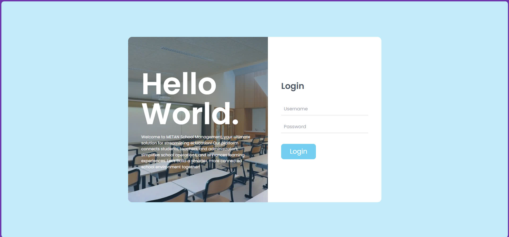
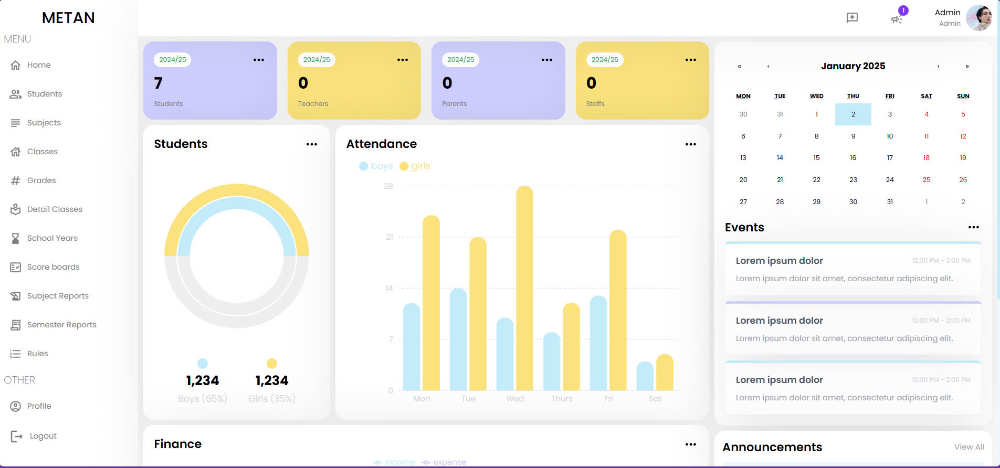
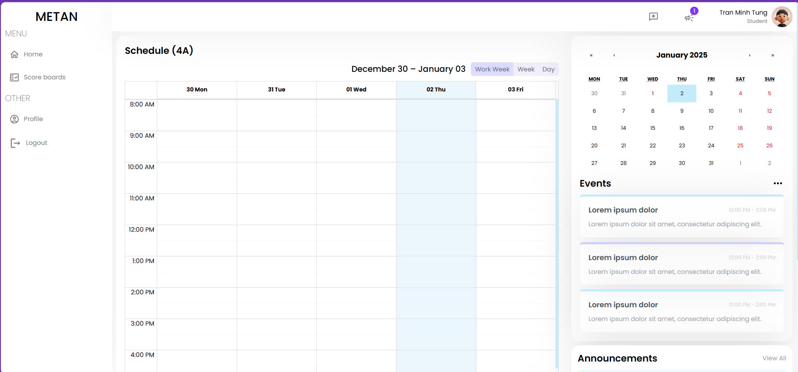
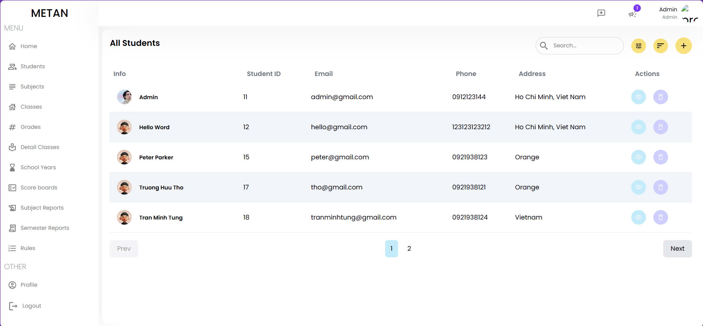
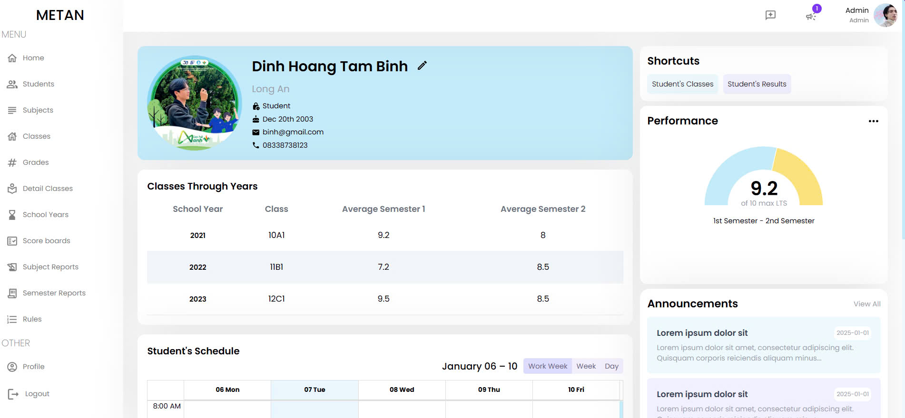

# 📘 School Management System Web Application

The School Management System is a web application designed to streamline the management of school operations and provide a platform for students and administrators to access and manage school data efficiently. The application caters to two user roles: Students and Admins, ensuring secure access and role-specific functionalities.

## 🌟 Features
- Role-based Access:
  - **Students**: Can view their academic results but cannot edit them.
  - **Admins**: Have full control over school data, including student records, classes, grades, and more.

### 👨‍🎓 Student Role
-**View Results:** Students can access detailed reports of their academic performance, including semester grades and subject-wise marks.

### 🔧 Admin Role
1. Student Management.
  - Add, edit, and delete student records.
  - Assign students to classes and grades.
2. Academic Year Management.
  - Define academic years and manage associated records.
3. Subject Management.
  - Create and edit subjects offered by the school.
4. Class & Grade Management.
  - Organize students into classes and grades for different academic years.
5. Grade Entry.
  - Enter and update subject scores for students.
6. Report Management.
  - Generate subject-specific reports for each semester.
  - Generate overall semester performance reports for students.
7. Edit rules

## 💻 Technologies Used
### ✔️ Front-end
- **ReactJS**: Front-end framework for building user interfaces.
- **React Router**: For managing navigation between pages.
- **@tanstack/react-query**: For managing server state and data fetching.
- **SCSS**: For styling the application.

### ✔️ Back-end
- **Node.js:** To build scalable server-side logic.
- **Express:** A web framework for Node.js for building APIs.
- **JWT (JSON Web Token):** For secure authentication.
- **PostgreSQL**: A powerful relational database for storing user, subject, grade, and report data.
- **Prisma**: A modern ORM for managing database models and queries seamlessly.

## 🛠️ System Requirements

Before running the application, ensure you have the following installed:
- Node.js 20.17.0 __(Recommend)__
- PostgreSQL installed.
- Git installed.

## 🚀 Getting Started
### ✔️ Backend Setup
1. Clone the backend repository:
    ```
    git clone https://github.com/Havold/SE104-QLHS-BE.git
    cd SE104-QLHS-BE
    ```

2. Install the dependencies:
    ```
    npm install
    ```

3. Set up your `.env` file with the following environment variables:
    ```
    PORT = 8080
    DATABASE_URL="postgresql://<username>:<password>@localhost:5432/QLHS"
    JWT_SECRET = your_jwt_secret
    
    DESTINATION_DIR = "uploads/"
    ```
4. Set up Prisma:
  - Initialize the Prisma schema
    ```
    npx prisma init
    ```
  - Generate Prisma client
    ```
    npx prisma generate
    ```
  - Migrate the database schema:
    ```
    npx prisma migrate dev --name init
    ```

5. Run the backend server:
    ```
    npm start
    ```
    
⚠️ **Note:** These are just the basic settings. For more details on creating a database, please check out my BE project: https://github.com/Havold/SE104-QLHS-BE
### ✔️ Frontend Setup
1. Clone the frontend repository:
  ```
    git clone https://github.com/Havold/SE104-QLHS-FE.git
    cd SE104-QLHS-FE
  ```
2. Install dependencies:
   ```
   npm install
   ```
4. Run the frontend development server:
    ```
    npm start
    ```
## ⚡ Usage
1. Open your browser and navigate to:
    ```
    http://localhost:3000
    ```
2. Login
   - As a **Student**, view your academic results.
   - As an **Admin**, manage school records and generate reports. (Account's admin defautl is admin and password: 123123)
3. Explore the features to manage academic data efficiently.

## 🖼️ Screenshots
__1. Login Page__


__2. Home Page (Admin Role)__


__3. Home Page (Student Role)__


__4. List of Students__


__5. Student Profile__


## ⚠️ Important Notice
- This project uses PostgreSQL and Prisma for database operations. Ensure the database is properly set up and accessible via the configured DATABASE_URL.
- The backend setup requires Prisma migrations. Refer to the prisma/schema.prisma file for the database schema details.
- This project needs a Back-end, I suggest you check out my BE project here: https://github.com/Havold/SE104-QLHS-BE
----------------------------------------------------------------------------------------
